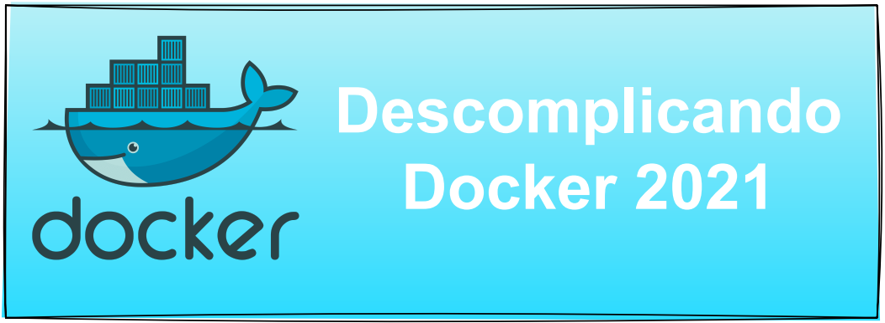
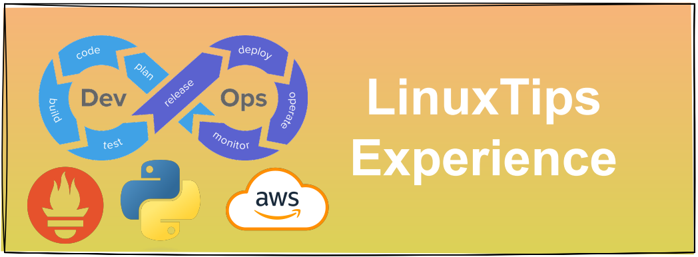
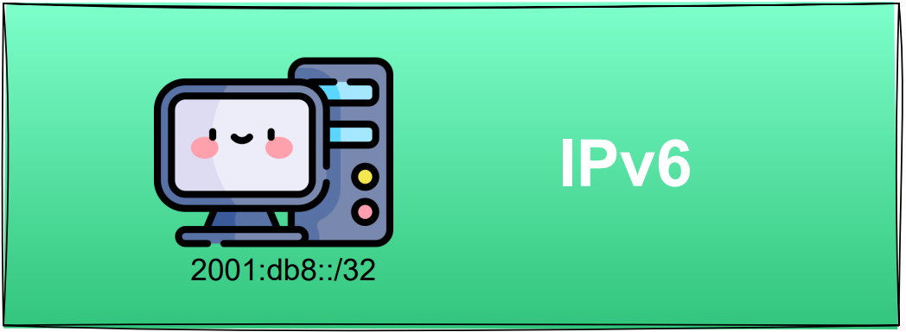

---

## Olá sou **Julio Cesar Fenuchi**
### tenho 22 anos
### estou cursando **redes de computadores** no IFRN (Campus natal cental)
### entusiasta por **Python ♥**                                            
### atualmente faço parte de um grupo de pesquisa chamado **Latarc**

---

## **Entre em contato comigo:**

 

---
## **essas são algumas tecnologias que eu conheço:**

 

---
## **minhas Badges:**

---
## **Certificados:**  

&emsp;

&emsp;

&emsp;

&emsp;
 

&emsp;

&emsp;
 

&emsp;

&emsp;
 

&emsp;

&emsp;
 

&emsp;

&emsp; &emsp;

&emsp;
 

---
## **Algumas tecnologias que quero aprender:**
  

---
  

   

---